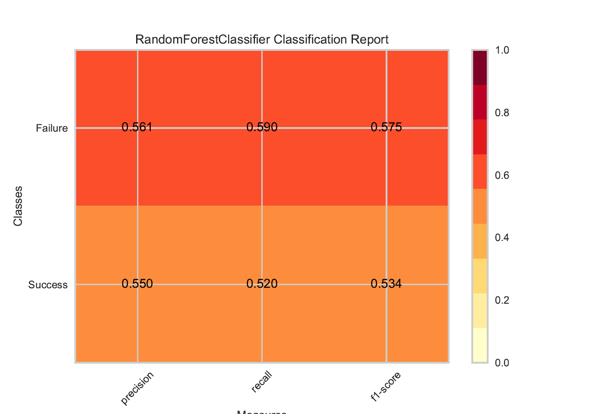
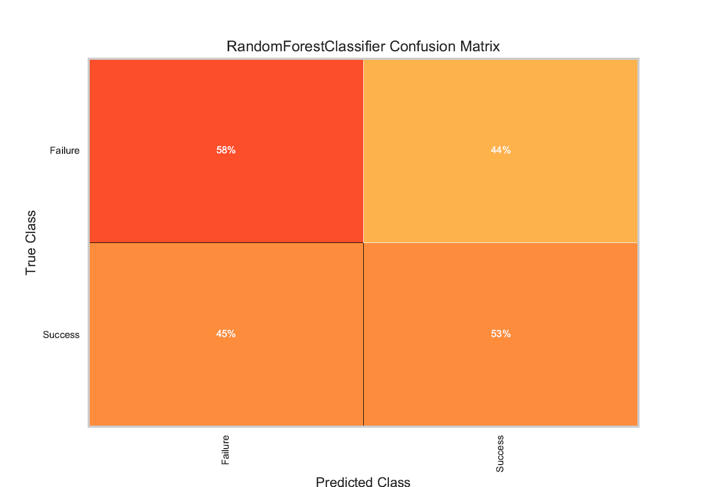
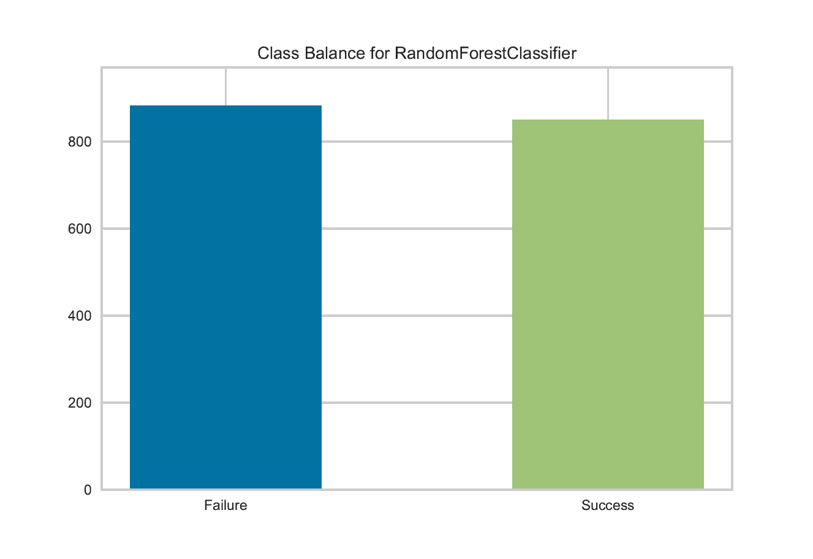
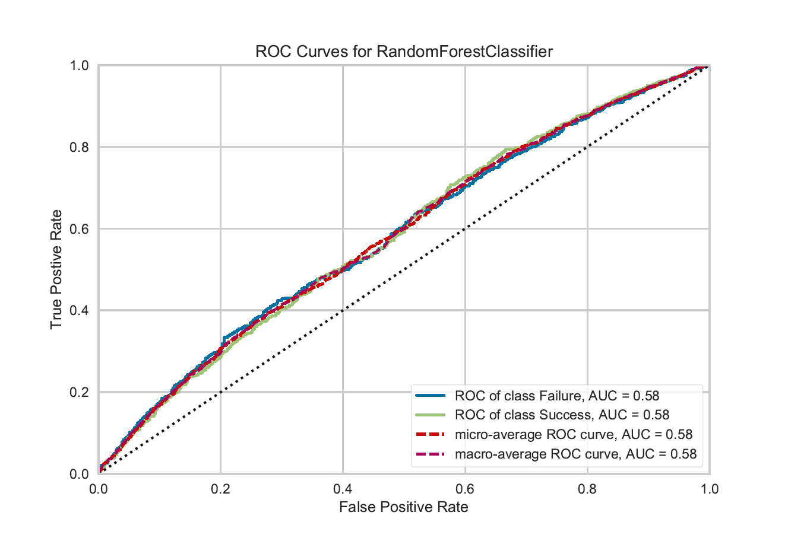

# What's in a name?  Predicting the Popularity of Posts by Title

----------------------------------------------------------------------------------------------------

When writing an article, blog, or post we all worry about whether others will read it, like it, or even share it.  I too suffer from this common anxiety; I want my writings to be popular!  I often wondered why my posts received less clicks/likes than another's.  On the surface, the only obvious differences were the title of the posts.  With this thought in mind, I began to formulate a hypothesis.  Maybe the title/name of a post correlates with its popularity?  If this is so, then maybe I can reverse-engineer the process and pick only popular titles.

This leads us to the purpose of this article. The purpose of this article is to describe my efforts to predict whether or not a post to the [/r/datascience](https://www.reddit.com/r/datascience) subreddit will be popular. I define popularity as receiving more than the average number of upvotes.  I take a unique approach in making this prediction.  My prediction methodology is based solely on the title of the redditor's post, hence this blog's title: What's in a name?.  

I will primarily be using two tools.  For visualization, I am excitedly using a package called [Yellowbrick](http://www.scikit-yb.org/en/latest/).  Yellowbrick rings true the phrase, a picture is worth a thousand words.  Yellowbrick's visuals can help you make quick interpretations of the performance of your machine learning model.  For model building, I am using the well-known [Sci-kit learn](http://scikit-learn.org/stable/) package.

We will take four major steps to build our prediction model.  Firstly, we will obtain and preprocess our data.  Secondly, we will extract information/features from the titles, this includes things such as the number of vowels, consonants, and parts-of-speech.  Thirdly, we will perform the actual modeling which includes choosing an algorithm and generating a prediction model.  Fourthly, we will evaluate the performance of the model and explore how to fine-tune it.

## Data Ingestion
We begin by retrieving metadata from every post to the /r/datascience subreddit for the past 3 years; this is approximately 9000 posts.  The table below is a sample of the collected metadata.  The 'id' column is a unique identifier for each post.  The 'subreddit' column specifies the subreddit the post originated from.  The 'url' column is a link to either the reddit page or external page that the post references.  The 'ups' column is a count of the number of upvotes a post has received.  The 'created_utc' column specifies the post's creation date.  


|  id  |  subreddit  |                                                                                                                                                   title                                                                                                                                                   |ups|                                                                                                                                url                                                                                                                                |created_utc|
|------|-------------|-----------------------------------------------------------------------------------------------------------------------------------------------------------------------------------------------------------------------------------------------------------------------------------------------------------|--:|-------------------------------------------------------------------------------------------------------------------------------------------------------------------------------------------------------------------------------------------------------------------|----------:|
|84zvji|r/datascience|Academic data science training programs: crowd-sourced list                                                                                                                                                                                                                                                |  2|https://www.reddit.com/r/datascience/comments/84zvji/academic_data_science_training_programs/                                                                                                                                                                      | 1521243666|
|84xz2e|r/datascience|FPGA-embedded ML                                                                                                                                                                                                                                                                                           |  2|https://www.reddit.com/r/datascience/comments/84xz2e/fpgaembedded_ml/                                                                                                                                                                                              | 1521227458|
|84v4xp|r/datascience|Fight Crime with Social Network Analysis                                                                                                                                                                                                                                                                   | 30|https://medium.com/@20bd85b6b74f/7a879d4a65ea                                                                                                                                                                                                                      | 1521204301|


We obtained this data by using the [PRAW python package](https://praw.readthedocs.io/en/latest/), which is a Reddit API Wrapper.  Although we don't provide you with the full dataset, you can use PRAW in conjunction with these post [IDs](data/post_ids.csv) to rebuild it.  The full dataset will be referenced as 'processed_datascience.csv.bz2' throughout the article.  In its current state the dataset still isn't useable because Sometimes a post is submitted multiple times therefore we needed drop duplicate posts from our data (see below).  The data in its current state is now considered a corpus.  A corpus is a collection of documents.  In our case the documents are the titles of the posts.  

```python
import pandas as pd

data = pd.read_csv('processed_datascience.csv.bz2')
data.drop_duplicates('title', inplace=True)
```


## Feature and Target Extraction

Machine-learning classification tasks require two components, a target(s) and a feature(s).  It is the relationship between the features and target that allows us to predict if a title will be popular or unpopular.  A feature is an individual measurable property or characteristic of a phenomenon being observed. In our case, the title phrase is the measurable feature.  However, we can also generate multiple new features from the title phrase.  This includes a count of the number of words, characters, vowels, consonants, syllables, different parts of speech, and noun phrases in each title.  This further includes a measure of the subjectivity, polarity, reading grade level, and readability of each title.   A target is the class that is being predicted(i.e. popular or unpopular).  In our case, the target is a proxy for votes.  If a title received less than the average number of votes then the title was labeled as unpopular and the opposite if greater than average number of votes. Features are typically expressed numerically thus we would need to employ ["term frequency-inverse document frequency"](https://nbviewer.jupyter.org/github/lwgray/ddl/blob/master/blog-posts/calzone/tfidf.ipynb)(tf-idf) to convert the entire title phrase into numbers. 


### Initial Text Processing

We will further manipulate the documents of the corpus so they can be easily compared to each other.  Firstly, all titles are converted to lowercase and the backslash characters are removed.  Secondly, the titles are lemmatized.  Lemmatization is the process of changing words to their root words, for example 'wanted' to 'want'.  This is important because it reduces the total number of words and therefore the complexity of the corpus.  We used the WordNet Lemmatizer from the NLTK package(see code below) for this processing.

```python
from nltk.stem.wordnet import WordNetLemmatizer
from nltk import word_tokenize
from nltk import pos_tag

def lemma(token, tag):
    lemmatizer = WordNetLemmatizer()
    if tag[0].lower() in ['n', 'v']:
        return lemmatizer.lemmatize(token, tag[0].lower())
    return token


def lemmatize(data):
    tagged_corpus = [pos_tag(word_tokenize(title)) for title in data['title'].str.replace("/", " ").str.lower()]
    lc = [" ".join([lemma(token, tag) for token, tag in title]) for title in tagged_corpus]
    return lc
```


### Intial Data Exploration

If we look at all the words contained in our corpus we can develop an overview of the usage of each word, excluding the most common words(a, the, of, etc).  We use Yellowbrick to generate a frequency distribution chart that showcases the most common terms.  As expected, since we are in /r/datascience, the term data scientist is at the top of the word list.  Most interesting are the themes that become apparent.  In the list below you can see that the words can be categorized into four areas.  Each area is comprised of some of the words in parentheses.  It appears that the titles are dominated by the subject of the education required to find employment for a certain position.

1.  Positions (data scientist, analyst)
2.  Tools & Topics (big data, python, machine learning, etc)
3.  Employment (Career, experience, job, work)
4.  Education ( learning, course, masters)

If we look at the distribution of the votes from all the titles.  We see that the distribution is left-skewed with a large portion of the titles receiving less than 10 votes.


### Text Features

The titles provide us with two different types of information.  The first type is the general attributes of the title; i.e. how many words, syllables, vowels, etc... (see above for list of attributes) in each title.  The second type is the words themselves.  The question is how do we use both types of information to predict if a title will be successful.  For the attributes, it is simple because they are numbers; it could be as easy as finding out which combination of attributes define success versus failure.  How to define success with just words becomes tricky.  Essentially, performing machine learning on the titles requires that the text content be turned into numerical feature vectors(feature extraction).  

For feature extraction on the titles, we used a count vectorizer that measures term frequency(tf); i.e. how often a word appears in a title.  For instance, if we do this for the following sentences, then we produce the matrix below.  


#### Title A: The dog jumped over the fence
#### Title B: The cat chased the dog
#### Title C: The white cat chased the brown cat who jumped over the orange cat


||the |dog |jumped |over |fence |cat |chased |white |brown |who |orange|
|----------|----|----|-------|-----|------|----|-------|------|------|----|------|
|Title A   | 2  |  1  |  1     |  1   |   1   |  0  |   0    |   0   |   0   |  0  |   0   |
|Title B   | 1  |  1  |  0     |  0   |   0   |  1  |   1    |   0   |   0   |  0  |   0   |
|Title C   | 3  |  0   | 1     |  1   |   0   |  3  |   1    |   1   |   1   |  1  |   1   |


The downside of just using tf is that words that appear most often tend to dominate the matrix.  To overcome this, we used the product of term frequency and inverse document frequency(tf-idf).  Idf is the measure of whether a term is common or rare across all documents [Side note 2]. 

Essentially, tf-idf creates a word vector in which a word is weighted by its occurence not only in the title it was derived from, but also the corpus (the entire group of titles). A complete example on how tf-idf is calculated can be found [here](https://nbviewer.jupyter.org/github/lwgray/ddl/blob/master/blog-posts/calzone/tfidf.ipynb).

The tf-idf process leaves us with about a vocabulary of 58,000 (see side note, for explanation of why this is so large).  Not all these words/phrases are going to provide useful information.  The trick is to find a reduced dimensional representation of our matrix that emphasizes the strongest relationships and throws away the noise.  To achieve this, we use a dimension reduction technique called TruncatedSVD aka Latent Semantic Analysis[(LSA)](https://technowiki.wordpress.com/2011/08/27/latent-semantic-analysis-lsa-tutorial/).  After reducing our dimensions with LSA, we further compact our matrix by using Anova F-Value feature selection.

Let's not forget about the title attributes, they also need to undergo feature selection.  We did this by using tree-based estimators(ExtraTreesClassifier) to compute feature importance, which can be used to discard irrelevant features.  This resulted in a reduction from 45 to 17 most important attributes.

## Modeling
- Describe modeling process 
- Describe binary classification 

### Model Pipeline
```python
# 1. Sklearn has a pipeline Class that directs the flow of model creation; 
# below the pipeline corals the features into the Random Forest classifer.
# 2. Within the pipeline is a sklearn Class called FeatureUnion.  
# 3. Feature Union allows for the joining of multiple features into a single vector
# 4. Within the feature union is a transformer list,
# containingclasses that performed the functions described above
# 5. The final pipeline item is the declaration of a classifier,
# that the combined feature vector will be inserted into

pipeline = Pipeline([
    ('union', FeatureUnion(
        transformer_list=[

            ('pipe', Pipeline([
                ('inner', FeatureUnion(
                    transformer_list=[
                        ('pos', POS()),

                        ('read', Readable()),

                        ('words', Words()),

                        ('blob', Pipeline([
                            ('all', Blob()),
                            ('minmax', MinMaxScaler()),
                        ])),
                ])),
                ('select', SelectFromModel(ExtraTreesClassifier()))

            ])),

            ('title', Pipeline([
                ('tfidf', TfidfVectorizer(token_pattern=u'(?ui)\\b\\w*[a-z]+\\w*\\b', 
                                          ngram_range=(1,3), sublinear_tf=True,
                                          strip_accents='unicode', stop_words='english')),
                ('svd', TruncatedSVD(n_components=120)),
                ('normalize', MinMaxScaler(copy=False)),
                ('selector', SelectPercentile(f_classif, percentile=10))
            ])),


            ])),
    ('clf', RandomForestClassifier(n_estimators=190, n_jobs=-1, max_depth=5, max_features='log2',
                                  min_samples_leaf=1, min_samples_split=77)),
        ])

# Train model
pipeline.fit(train_X, train_y)

# Predict Test Set
y_pred = pipeline.predict(test_X)

# Save our model
joblib.dump(pipeline, 'datascience.xz', compress=('xz', 9))

# Test it out
pipeline.predict(pd.Series(['A tutorial on my machine-learning workflow \
                            for predicting whether or not this post will be popular']))
```

### Model Evaluation

``` python
# Measure prediction Accuracy and F1 Score
accuracy = accuracy_score(y_pred=y_pred, y_true=test_y)
print('Accuracy: {:03.1f}%'.format(accuracy * 100))

print('F1 Score: {:.3f}'.format(f1_score(test_y, y_pred)))

# Cross Validate prediction Score
print('CV Scores: ', cross_val_score(pipeline, train_X, train_y, cv=5))
```

In the graphs below, False or Failure equates to less than 7.5 votes while True or Success equates to greater than 7.5 votes
All the graphs were generated by Yellowbrick.
    1.  Top left: Classification Report
    2.  Top Right: Confusion Matrix
    3.  Bottom Left: Class Balance
    4.  Bottom Right: ROC-AUC Curve


Yellowbrick's Documentation succiently summarizes the importance of these graphs, see [here](http://www.scikit-yb.org/en/latest/api/index.html) and I quote the text below.

1. The classification report visualizer displays the precision, recall, and F1 scores for the model. The higher the score, the more predictive power your model contains.  My model has slightly over 50%, in other words, a toss of a coin.

2. The confusion matrix shows how each of the test values predicted classes compare to their actual classes. Data scientists use confusion matrices to understand which classes are most easily confused.

3. Oftentimes classifiers perform badly because of a class imbalance. A class balance chart can help prepare the user for such a case by showing the support for each class in the fitted classification model.  My classes were fairly balanced.

4. A ROCAUC (Receiver Operating Characteristic/Area Under the Curve) plot allows the user to visualize the tradeoff between the classifier’s sensitivity and specificity.  You will notice that this model has neither sensitivity nor specificity.

|Classification Report          |Confusion Matrix               |
|:-----------------------------:|:-----------------------------:|
|  |  |

| Class Balance                 | ROC Curve                     |
|:-----------------------------:|:-----------------------------:|
|  |  |


### Hyperparameter Tuning

## Experimentation
To test our model in the wild, we input different titles into the model then chose a title that was predicted to be "Popular".  Our chosen title was "A tutorial on my machine-learning workflow for predicting whether or not a post will be popular!"  Next, I published this exact article(the one you are currently reading) to r/datascience, r/machinelearning, and r/python subreddits.  The results after a couple of days were astonishing, the datascience subreddit post received 17 votes while machinelearning and python only got 0 and 1 votes respectively.  You might be confused by the zeor/one votes but the model worked as it was built for. The r/machinelearning and r/python postings were meant as controls since our model was built specifically for r/datascience subreddit.  The 17 votes may not seem like a lot of votes, but you need to take into consideration that unpopular posts in /r/datascience receive on average 2 votes. 

## Conclusion
It is known that day and time are powerful predictors of votes (likes, retweets) but by not confining/limiting my predictions to these temporal parameters I will be able to show that an underlying structure exists that correlates titles to upvotes.  My goal was to go through and document the entire process of building a classifier.  I learned a lot.  Now, I know that a Reddit title isn't sufficient enough to predict whether or not a post will be successful.  Getting to this conclusion after so many hours of work was heartbreaking but at the same time very fulfilling.  I hope you can take my failure and use it to build successful models.  Also, I hope you will return for my follow-up blog post on how to predict the number of votes a title will receive.  Until next time, Adios :)